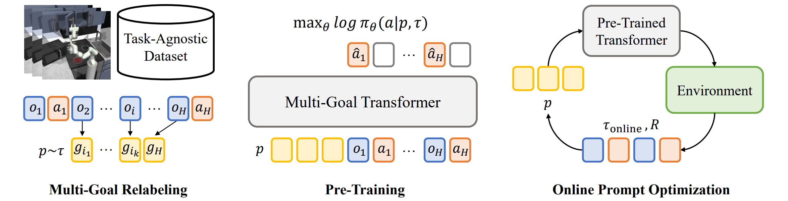

# MGPO: Pre-Trained Multi-Goal Transformers with Prompt Optimization for Efficient Online Adaptation

Official implementation of **[NeurIPS 2024]** [Pre-Trained Multi-Goal Transformers with Prompt Optimization for Efficient Online Adaptation](https://openreview.net/forum?id=DHucngOEe3).



Previous works in skill pre-training utilize offline, task-agnostic dataset to accelerate RL. However, these approaches still require substantial RL steps to learn a new task. We propose MGPO, a method that leverages the power of Transformer-based policies to model sequences of goals during offline pre-training, enabling efficient online adaptation through prompt optimization.

## Installation
- Create a conda environment with `python==3.8.5`. Install python packages in `requirements.txt`.
- For the Crafter environment, `pip install crafter==1.8.3` or see the [repo](https://github.com/danijar/crafter).
- Download datasets from [this link](https://disk.pku.edu.cn/link/AA5B51257BE60D45668EA68A764BF3E00A). For the Crafter dataset, merge the two zipped files with `cat crafter_dataset_part_* > crafter_dataset.tar.gz`, then unzip the output `crafter_dataset.tar.gz`. Place them in the `dataset/` folder as follows:

dataset/
├── kitchen_t500_test.pkl/
└── kitchen_t500_train.pkl/
└── xxxxxx.pkl
└── crafter_dataset/
│   ├── 0.pkl
│   └── xxx.pkl


## Offline Pre-Training
Train the Transformer policy on MazeRunner-15 as an example: run `python train.py --env mazerunner --dataset_path 'dataset/mazerunner-d15-g4-4-t64-multigoal-astar.pkl' --max_prompt_len 5 --K 64 --max_ep_len 64 --batch_size 64 --test_optimal_prompt --subsample_trajectory --subsample_min_len 10`

Training scripts for all environments are listed in `train.sh`. Checkpoints are saved in `model_saved/`.

## Online Adaptation with Prompt Optimization
Test the policy on MazeRunner-15 using MGPO-UCB as an example: run `python prompt_tuning_ucb.py --env mazerunner --dataset_path 'dataset/mazerunner-d15-g4-4-t64-multigoal-astar.pkl' --max_prompt_len 5 --K 64 --max_ep_len 64 --load-path 'model_saved/gym-experiment-xxx/prompt_model_mazerunner_iter_4999' --task -1 --max_test_episode 100`, where `--load-path` is the model checkpoint dir.

Test scripts for all environments with MGPO-explore, MGPO-UCB, and MGPO-BPE are listed in `test.sh`. Results are saved in `eval_results/`.


## Using Your Own Environment & Dataset
- Make an environment directory `envs/$ENV_NAME` and place all files related to the env wrapper and dataset here. The wrapper should be a gym-style env. See `envs.mazerunner.utils.MazeRunnerEvalEnv` as an example.
- To train the model in this env, you should implement the file `envs/$ENV_NAME/utils.py` with two functions: 1. `get_train_test_dataset_envs()`, 2. `get_prompt()`. See the MazeRunner's implementation as an example.
- At the beginning of `train.py`: 
  - add `import envs.$ENV_NAME.utils as $ENV_NAME_utils`
  - add to the `CONFIG_DICT`: `'$ENV_NAME': $ENV_NAME_utils`


## Citation
If you find this code useful, please cite our paper:
```bibtex
@inproceedings{yuanpre,
  title={Pre-Trained Multi-Goal Transformers with Prompt Optimization for Efficient Online Adaptation},
  author={Yuan, Haoqi and Fu, Yuhui and Xie, Feiyang and Lu, Zongqing},
  booktitle={The Thirty-eighth Annual Conference on Neural Information Processing Systems},
  year={2024}
}
```
Our implementation is based on [PromptDT](https://github.com/mxu34/prompt-dt). You may also cite this work.
